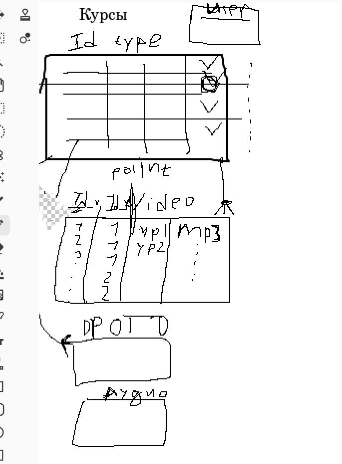

# Склад курсов
1)	Информация о ресурсе:
    - `GET /info` (ручка для получения информации о нашем сервисе) 
2)	Творчество:
    - живопись:
        - `GET /creativity/painting` (ручка для получения N актуальных курсов по живописи):
            - name
            - author
            - duration
            - price
        - `GET /creativity/painting/{cource_name:str}` (ручка для получения N актуальных курсов по живописи) 
        - `POST /creativity/painting` (ручка для добавления нового курса по живописи)
    - поэзия:
        - `GET /creativity/literature` (ручка для получения N актуальных курсов по литературе)
        - `GET /creativity/literature/{cource_name:str}` (ручка для получения N актуальных курсов по литературе)
        - `POST /creativity/literature` (ручка для добавления нового курса по литературе)
    - музыка:
        - `GET /creativity/music` (ручка для получения N актуальных курсов по музыке)  
        - `GET /creativity/music/{cource_name:str}` (ручка для получения N актуальных курсов по музыке)
        - `POST /creativity/music` (ручка для добавления нового курса по музыке) 
3)  Видео материалы
4)  Фотогалерея
5)  Аудиозаписи
6)  Контакты

## Видео
Для видео используется простой вариант: один `multipart/form-data` запрос создаёт запись и сразу сохраняет файл на диск.

Поддерживаемые форматы файлов: `mp4`, `mkv`, `mov`.

Пример:
```bash
curl -X POST "http://127.0.0.1:8000/v1/video/" \
  -F "title=Урок 1" \
  -F "author=Нана" \
  -F "course=Название курса" \
  -F "file=@./example.mp4"
```

После загрузки файл доступен по адресу вида:
`http://127.0.0.1:8000/media/<filename>`

### Дозагрузка файла к существующему видео
```bash
curl -X POST "http://127.0.0.1:8000/v1/video/upload/" \
  -F "video_name=Урок 1" \
  -F "file=@./example.mkv"
```

### Просмотр или скачивание файла
```bash
# Открыть в браузере
curl "http://127.0.0.1:8000/v1/video/file/?video_name=Урок%201&download=false"

# Скачать как файл
curl -OJ "http://127.0.0.1:8000/v1/video/file/?video_name=Урок%201&download=true"
```

# Схема Архитектуры БД


# Настройка среды
## Версионирование Python на Windows
1. Установить pyenv-win. Выполнить в PowerShell: 
```bash
Invoke-WebRequest -UseBasicParsing -Uri "https://raw.githubusercontent.com/pyenv-win/pyenv-win/master/pyenv-win/install-pyenv-win.ps1" -OutFile "./install-pyenv-win.ps1"; &"./install-pyenv-win.ps1"
```
2. Перезапустить PowerShell
3. Установить Python нужной версии:
```bash
pyenv install 3.12.10
```
4. Выполнить в терминале VS code:
```bash
pyenv shell 3.12.10
```

## Настройка окружения
- Создать .venv через
```bash
python3.12 -m venv .venv
py -m venv .venv
```
- Активируем окржение (команда дя windows)
```bash
source .venv/Scripts/activate
# или .venv\Scripts\activate
```
Для проверки версии Питон 
```bash
python -V
```

- Устанавливаем poetry
```bash
pip install poetry==1.8.2
```
- Фиксируем зависимости в lock файле
```bash
poetry lock
```
- Устанавливаем зависимости проекта
```bash
poetry install
```
Запустить сервис через команду
```bash
uvicorn app.main:app --reload --host 0.0.0.0 --port 8000
```
Для проверки работы сервиса выполнить
```bash
http://127.0.0.1:8000/docs
```

Для проверки работы ручки можно выполнить curl запрос
```bash
curl -X 'GET' \
  'http://127.0.0.1:8000/v1/creativity/painting' \
  -H 'accept: application/json'
```

#ДЗ
- Реализовать ручку:
    - `GET /creativity/poetry` (ручка для получения N актуальных курсов по поэтическому искусству)


# Настройка миграций
0. Убедиться что создан .env с необходимыми переменными для конфигурации БД (с DATABASE_URL)
1. Выполнить
```bash
alembic init alembic
```
2. Настроить alembic/env.py файл
3. Сгенерировать миграцию:
```bash
alembic revision --autogenerate -m "migration name"
```
4. Применить ВСЕ миграции
```bash
alembic upgrade head
```
Документация:
https://alembic.sqlalchemy.org/en/latest/tutorial.html

4. Откатиться на одну миграцию назад
```bash
alembic downgrade -1
```

# Запуск сервиса
1. Выполнить в терминале
В докере:
```bash
docker compose up app --build
```

Вне докера:
```bash
uvicorn app.main:app --reload --host 0.0.0.0 --port 8000
```

2. Перейти в интерактивную документацию swagger
http://127.0.0.1:8000/docs

ДЗ:
- Написать функционал для получения Video по его названию
