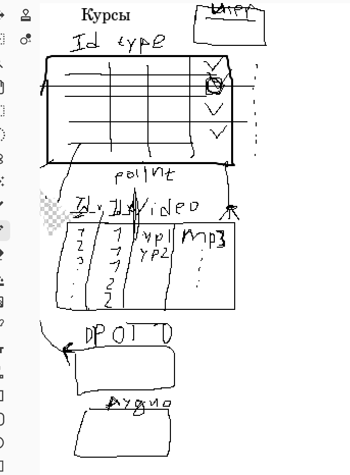

# Склад курсов
1)	Информация о ресурсе:
    - `GET /info` (ручка для получения информации о нашем сервисе) 
2)	Творчество:
    - живопись:
        - `GET /creativity/painting` (ручка для получения N актуальных курсов по живописи):
            - name
            - author
            - duration
            - price
        - `GET /creativity/painting/{cource_name:str}` (ручка для получения N актуальных курсов по живописи) 
        - `POST /creativity/painting` (ручка для добавления нового курса по живописи)
    - поэзия:
        - `GET /creativity/literature` (ручка для получения N актуальных курсов по литературе)
        - `GET /creativity/literature/{cource_name:str}` (ручка для получения N актуальных курсов по литературе)
        - `POST /creativity/literature` (ручка для добавления нового курса по литературе)
    - музыка:
        - `GET /creativity/music` (ручка для получения N актуальных курсов по музыке)  
        - `GET /creativity/music/{cource_name:str}` (ручка для получения N актуальных курсов по музыке)
        - `POST /creativity/music` (ручка для добавления нового курса по музыке) 
3)  Видео материалы
4)  Фотогалерея
5)  Аудиозаписи
6)  Контакты

## Видео
Для видео используется простой вариант: один `multipart/form-data` запрос создаёт запись и сразу сохраняет файл на диск.

Поддерживаемые форматы файлов: `mp4`, `mkv`, `mov`.

Пример:
```bash
curl -X POST "http://127.0.0.1:8000/v1/video/" \
  -F "title=Урок 1" \
  -F "author=Нана" \
  -F "course=Название курса" \
  -F "file=@./example.mp4"
```

После загрузки файл доступен по адресу вида:
`http://127.0.0.1:8000/media/<filename>`

### Дозагрузка файла к существующему видео
```bash
curl -X POST "http://127.0.0.1:8000/v1/video/upload/" \
  -F "video_name=Урок 1" \
  -F "file=@./example.mkv"
```

### Просмотр или скачивание файла
```bash
# Открыть в браузере
curl "http://127.0.0.1:8000/v1/video/file/?video_name=Урок%201&download=false"

# Скачать как файл
curl -OJ "http://127.0.0.1:8000/v1/video/file/?video_name=Урок%201&download=true"
```

# Схема Архитектуры БД


# Настройка среды
## Версионирование Python на Windows
1. Установить pyenv-win. Выполнить в PowerShell: 
```bash
Invoke-WebRequest -UseBasicParsing -Uri "https://raw.githubusercontent.com/pyenv-win/pyenv-win/master/pyenv-win/install-pyenv-win.ps1" -OutFile "./install-pyenv-win.ps1"; &"./install-pyenv-win.ps1"
```
2. Перезапустить PowerShell
3. Установить Python нужной версии:
```bash
pyenv install 3.12.10
```
4. Выполнить в терминале VS code:
```bash
pyenv shell 3.12.10
```

## Настройка окружения
- Создать .venv через
```bash
python3.12 -m venv .venv
py -m venv .venv
```
- Активируем окржение (команда дя windows)
```bash
source .venv/Scripts/activate
# или .venv\Scripts\activate
```
Для проверки версии Питон 
```bash
python -V
```

- Устанавливаем poetry
```bash
pip install poetry==1.8.2
```
- Фиксируем зависимости в lock файле
```bash
poetry lock
```
- Устанавливаем зависимости проекта
```bash
poetry install
```
Запустить сервис через команду
```bash
uvicorn app.main:app --reload --host 0.0.0.0 --port 8000
```
Для проверки работы сервиса выполнить
```bash
http://127.0.0.1:8000/docs
```

Для проверки работы ручки можно выполнить curl запрос
```bash
curl -X 'GET' \
  'http://127.0.0.1:8000/v1/creativity/painting' \
  -H 'accept: application/json'
```

# Настройка миграций
0. Убедиться что создан .env с необходимыми переменными для конфигурации БД (с DATABASE_URL)
1. Выполнить
```bash
alembic init alembic
```
2. Настроить alembic/env.py файл
3. Сгенерировать миграцию:
```bash
alembic revision --autogenerate -m "migration name"
```
4. Применить ВСЕ миграции
```bash
alembic upgrade head
```
Документация:
https://alembic.sqlalchemy.org/en/latest/tutorial.html

4. Откатиться на одну миграцию назад
```bash
alembic downgrade -1
```

# Запуск сервиса
0. **Применить миграции** — обязательно после каждого `git pull`, в котором появились новые файлы в `alembic/versions/` (например, таблица `refresh_token` для refresh-токенов). Иначе ручки будут падать с ошибкой вида `no such table: refresh_token`.
```bash
alembic upgrade head
```
Проверить, что БД на последней миграции (должно быть `(head)`):
```bash
alembic current
```

1. Выполнить в терминале
В докере:
```bash
docker compose up app --build
```

Вне докера:
```bash
uvicorn app.main:app --reload --host 0.0.0.0 --port 8000
```

2. Перейти в интерактивную документацию swagger
http://127.0.0.1:8000/docs

### Команда для запуска debuger локально 
python -m debugpy --listen 0.0.0.0:6789 --wait-for-client -m uvicorn app.main:app --host 0.0.0.0 --port 8000 --reload

# Авторизация: access- и refresh-токены

## Идея
Используются два токена с разными задачами:

| | Access-токен | Refresh-токен |
|---|---|---|
| Что это | JWT (подписан `SECRET_KEY`, внутри `sub` = логин и `exp`) | Случайная строка (`secrets.token_urlsafe`), не JWT |
| Срок жизни | `ACCESS_TOKEN_EXPIRE_MINUTES` (15 мин) | `REFRESH_TOKEN_EXPIRE_DAYS` (7 дней) |
| Где у клиента | В теле ответа `/login`, клиент держит его в памяти | В cookie `refresh_token` (`HttpOnly`, `Secure`, `SameSite=Strict`, `Path=/v1/user`) |
| Как отправляется | Заголовок `Authorization: Bearer <token>` | Браузер сам прикладывает cookie к запросам на `/v1/user/*` |
| Где на сервере | Нигде — проверяется только подпись | В таблице `refresh_token` хранится **SHA-256 хеш**, не сам токен |
| Можно отозвать | Нет, живёт до `exp` | Да — ставим `revoked_at` |

Зачем так:
- access-токен короткий: если его украдут, он скоро протухнет;
- refresh-токен длинный, но лежит в `HttpOnly`-cookie — JavaScript на странице (и XSS) не может его прочитать;
- в БД хранится хеш, поэтому утечка БД не даёт рабочих токенов;
- при каждом `/refresh` старый refresh-токен отзывается и выдаётся новый (**ротация**) — повторно использовать старый нельзя.

## Поток запросов
```
POST /v1/user/login   (логин + пароль)
  → тело:  {"access_token": "...", "token_type": "bearer"}
  → cookie: refresh_token=...

GET /v1/user/me       Authorization: Bearer <access>      → 200
... прошло 15 минут ...
GET /v1/user/me       Authorization: Bearer <access>      → 401

POST /v1/user/refresh (cookie уходит автоматически)
  → новый access в теле + новый refresh в cookie, старый refresh отозван

POST /v1/user/logout  → refresh отозван в БД, cookie удалена → 204
```

## Где что в коде
- `app/security.py` — `create_access_token`, `create_refresh_token`, `hash_refresh_token`
- `app/models.py` — модель `RefreshToken` (таблица `refresh_token`)
- `app/repositories.py` — `RefreshTokenRepository`; `revoke` делает `UPDATE ... WHERE revoked_at IS NULL`, чтобы два параллельных `/refresh` не обменяли один токен дважды
- `app/services.py` — `UserService.login / refresh / logout / _issue_tokens`
- `app/api/v1/endpoints/user.py` — ручки и установка cookie (`_set_refresh_cookie`)
- `app/dependencies.py` — `get_current_user`: проверка access-токена для защищённых ручек
- `tests/test_refresh_token.py` — тесты

## Проверка в Swagger
Проверено в Chrome. Открывать `http://127.0.0.1:8000/docs` или `http://localhost:8000/docs` (на этих адресах браузер принимает `Secure`-cookie и без HTTPS).

1. **Создать пользователя:** `POST /v1/user/` → Try it out → `{"login": "user1", "password": "pass1"}` → Execute → `201`.
2. **Залогиниться:** кнопка **Authorize** вверху → username `user1`, password `pass1` → Authorize. Swagger сам вызовет `POST /v1/user/login` и запомнит access-токен.
3. **Проверить access-токен:** `GET /v1/user/me` → Execute → `200`. В блоке Curl видно заголовок `Authorization: Bearer eyJ...`.
4. **Найти refresh-токен:** DevTools (F12) → **Application** → Cookies → `http://127.0.0.1:8000` → `refresh_token`. Обратите внимание на галочки `HttpOnly` и `Secure`.
   - В **Console** выполните `document.cookie` — вернётся пустая строка: JS cookie не видит, это и есть защита `HttpOnly`.
   - В **Network** → запрос `login` → Response Headers → `set-cookie: refresh_token=...`. В самом Swagger этого заголовка нет: браузер не отдаёт `Set-Cookie` в JavaScript.
5. **Обновить токены:** `POST /v1/user/refresh` → Try it out. Поле `refresh_token` **оставить пустым** — браузер подставит cookie сам → Execute → `200` и новый `access_token`. В Application значение cookie изменилось.
6. **Убедиться, что старый refresh-токен больше не работает:** скопировать значение cookie до шага 5 и выполнить
   ```bash
   curl -i -X POST http://127.0.0.1:8000/v1/user/refresh --cookie "refresh_token=<старое значение>"
   ```
   → `401`.
7. **Выйти:** `POST /v1/user/logout` → Execute → `204`. Cookie исчезла из Application, повторный `/refresh` → `401`.

Нюансы Swagger:
- Swagger сам не вызывает `/refresh`. Новый access-токен из шага 5 нельзя вставить в окно Authorize (там только логин/пароль), поэтому проверять его удобнее через curl:
  ```bash
  curl http://127.0.0.1:8000/v1/user/me -H "Authorization: Bearer <новый access_token>"
  ```
- Кнопка **Logout** в окне Authorize только забывает access-токен в Swagger. Ручку `/logout` она не вызывает — refresh-токен остаётся в cookie и в БД.

Как увидеть протухание access-токена, не дожидаясь 15 минут: поставить в `.env` `ACCESS_TOKEN_EXPIRE_MINUTES=1`, перезапустить сервис, залогиниться и через минуту вызвать `/me` → `401`, затем `/refresh` → снова работает.

Посмотреть записи в БД (видны только хеши и `revoked_at`):
```bash
python -c "import sqlite3; [print(r) for r in sqlite3.connect('app.db').execute('SELECT id, user_id, revoked_at, expires_at FROM refresh_token')]"
```

## Если что-то не работает
- `no such table: refresh_token` — не применены миграции: `alembic upgrade head`.
- Cookie не появляется в Application — сервис открыт не по `localhost`/`127.0.0.1` и без HTTPS. Для локальной разработки поставьте в `.env` `REFRESH_COOKIE_SECURE=false` (на проде всегда `true`).
- `/refresh` → `401` — нет cookie, токен отозван (logout или уже был использован) или истёк.

## Тесты
```bash
python -m pytest tests
```
Тесты используют отдельную временную SQLite-БД, `app.db` не трогают.

## Полезные команды для git

### Команда git stash временно «прячет» или сохраняет незаконченные изменения в рабочей директории, возвращая ваш код к последнему закоммиченному состоянию. Это позволяет переключиться на другую ветку или сделать срочный хотфикс, не создавая «грязный» коммит. 

### Команда git stash apply извлекает ранее сохраненные изменения (из «заначки») и возвращает их в вашу текущую рабочую директорию. В отличие от команды pop, она оставляет копию изменений в стеке, что позволяет применять их повторно в других ветках.

Задачи:
- Дописать ручки обработки видео по UoW
- Добавить обработку видео формата webm

Задача
- Регистрация пользователя (готово)
(!) Добавить пользователю  при создании в accessible_videos названия всех первых видео существующих курсов (опционально, разобраться что такое подзапросы в SQL)
Сделать следущее:
1. Создать объекты в таблице видео, где в названиях будет слово "ознакомительное"
2. Доработать get_introductory в VideoRepository
3. Доработать create в UserService
4. Создать нового пользователя и проверить, что в колонке accessible_videos по умолчанию подставились все ознакомительные видео, т.е. всем пользователям по умолчанию доступны все ознакомительные видео
- базовая авторизация пользователя
- реализовать функционал доступности видео для пользователя
- Добавить хэширование паролей
- Добавить jwt авторизазию
- Тесты
- Линтеры
- базовый CI/CD
